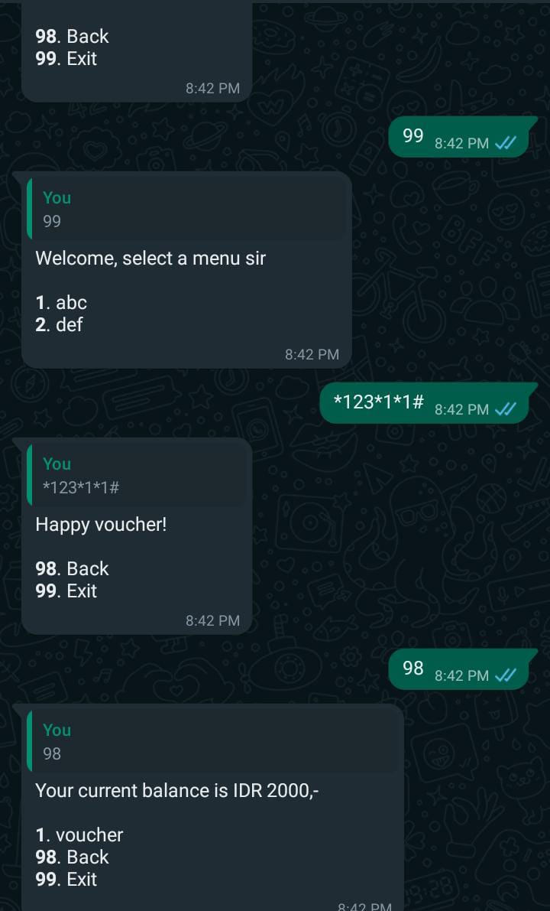

# Whatsappweb.js dial-based bot

It's a whatsapp bot but the desing pattern is like a dial, \*123# or something similar when you do USSD or SMS banking.

- If you're looking for REST API version, you can go here: https://github.com/snowfluke/wagate
- For more process-oriented whatsapp bot without a REST API, you can visit: https://github.com/snowfluke/wajs-bot-boilerplate

# Feat

1. Auto back button & exit button
2. Easy to develop, adding a new command? just make a new file inside `commands/` folder
3. Shortcode! *123*1\*1#
4. Type-safety with typescript
5. Ready to deploy with pre-configure Docker-script (tested on Railway)

# Configuration

Check config.json inside `config` folder

# Go try now!

Try by chatting \*123#

# Screenshot



# Instalation

## Deployment

```bash
npm install
npm run build
npm run start
```

## Development

```bash
npm run dev
```

# Debugging

- Delete `.wwebjs_auth` folder
- Delete `node_modules` folder
- Delete `package-lock.json` file
- Logout the linked devices on your Whatsapp
- Remove `whatsapp-web.js` from `package.json`
- Run `npm install github:pedroslopez/whatsapp-web.js#webpack-exodus`
